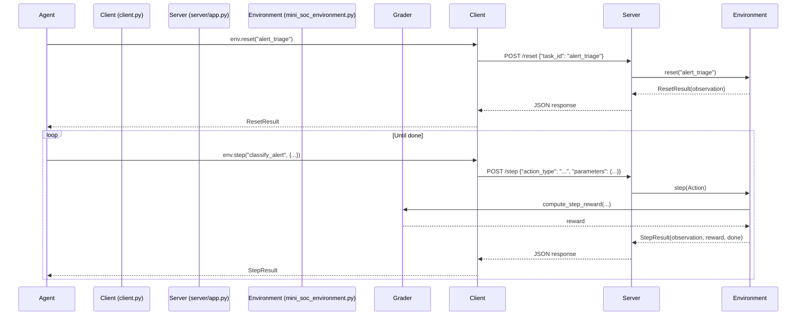

# Mini SOC — API Reference

## Architecture

## Environment Lifecycle

## Grader Scoring

### Task 1 — Alert Triage
| Component | Weight |
|---|---|
| Classification accuracy | 70% |
| Priority correctness | 30% |
| Coverage penalty | Multiplicative |

### Task 2 — Incident Investigation
| Component | Weight |
|---|---|
| Correct verdict | 35% |
| Attack type identified | 20% |
| Evidence gathered | 30% |
| Attacker IP identified | 15% |

### Task 3 — Active Threat Response
| Component | Weight |
|---|---|
| Containment (isolate + block) | 30% |
| Collateral damage penalty | -20% |
| Evidence gathering | 20% |
| Speed of response | 10% |
| Report quality | 20% |
